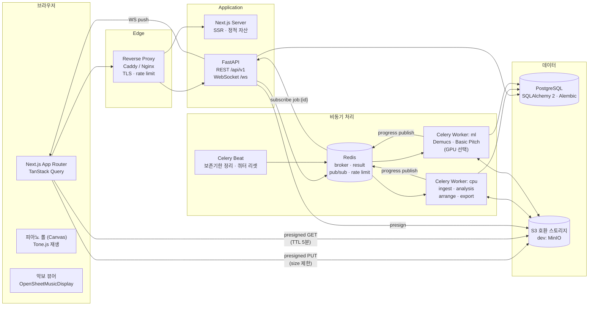
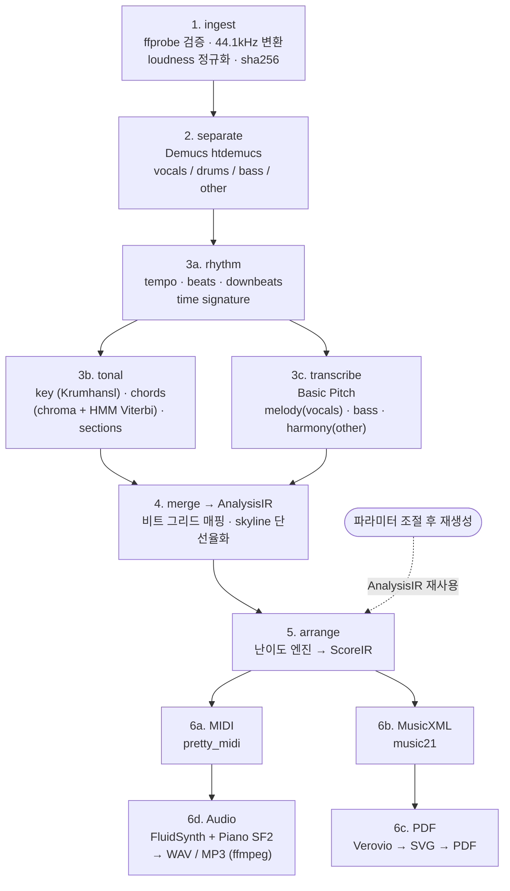
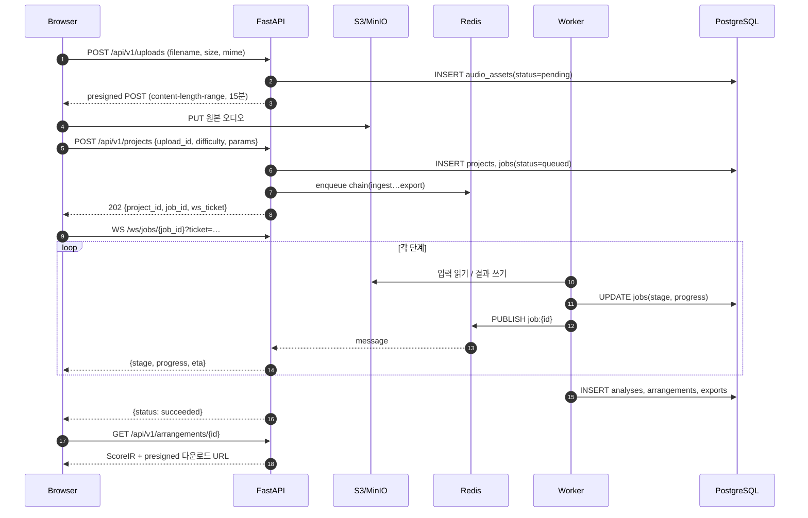
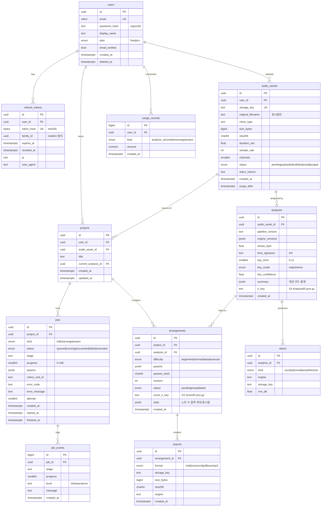

# PianoForge — Phase 1 시스템 설계

> 상태: Phase 1 승인 · **Phase 2 구현 완료** (백엔드·분석 파이프라인). API 계약은 [api.md](api.md) 참고.

## 1. 설계 원칙

- **분석과 편곡 분리**: 무거운 단계(분리·전사·분석)는 오디오당 1회만 수행하고 결과를 캐시한다. 난이도·파라미터 변경 시 편곡·내보내기 단계만 재실행한다 (재생성 수 초 단위).
- **Adapter + Fallback 체인**: 모든 ML/DSP 엔진은 인터페이스 뒤에 둔다. 런타임에 설치 여부를 감지해 `Demucs → HPSS(librosa) → Passthrough` 식으로 자동 강등한다. 결과에는 사용한 엔진과 버전을 기록한다.
- **중간 표현(IR) 중심**: 분석 결과는 `AnalysisIR`(JSON), 편곡 결과는 `ScoreIR`(JSON)로 표준화한다. MIDI·MusicXML·PDF·오디오는 모두 `ScoreIR`에서 파생된다.
- **대용량 데이터는 S3, 메타데이터는 PostgreSQL**: 노트 이벤트·비트 그리드·코드 시퀀스는 S3 JSON(gzip), DB에는 요약값과 객체 키만 저장한다.
- **보안 기본값**: 원본 파일명 미사용(UUID 키), presigned 업로드 크기 제한, 워커에서 ffprobe 검증, 짧은 TTL 다운로드 URL, 비루트 컨테이너.

## 2. 시스템 아키텍처



### 2.1 처리 파이프라인 (Celery chain)



- 3a(rhythm) 이후 3b/3c를 Celery `group`으로 병렬 실행하고, 4에서 `chord`로 합류한다. 코드 인식은 비트 단위 크로마를 쓰므로 비트 그리드가 먼저 필요하다 (Phase 2 구현 중 조정).
- 제어 흐름 예외(취소 `JobStopped`, Celery soft time limit)는 Adapter fallback을 건너뛰고 즉시 단계를 중단시킨다.
- 각 단계는 멱등(idempotent). 입력 해시 기준으로 S3 결과가 있으면 스킵한다.
- 단계 진행률은 `job:{id}` Redis 채널에 publish → API가 WebSocket으로 중계한다. WS 불가 시 TanStack Query 폴링(`GET /jobs/{id}`)으로 대체한다.

### 2.2 Adapter와 Fallback

| 인터페이스 | 1순위 | Fallback | 최종 Fallback |
|---|---|---|---|
| `SourceSeparator` | Demucs (htdemucs) | librosa HPSS + 저역 필터 | Passthrough (mix 그대로) |
| `NoteTranscriber` | Basic Pitch (ONNX/TFLite) | librosa pYIN (단선율) | — (오류) |
| `BeatTracker` | madmom DBN (설치 시) | librosa `beat_track` + PLP | 고정 120 BPM 그리드 |
| `KeyDetector` | Krumhansl-Schmuckler (chroma CQT) | — | C major (신뢰도 0) |
| `ChordRecognizer` | chroma 템플릿 + HMM Viterbi | 비트 단위 템플릿 매칭 | — |
| `ScoreEngraver` | Verovio | MuseScore CLI (설치 시) | PDF 미제공 (MusicXML만) |
| `AudioRenderer` | FluidSynth + SF2 | 사인파 합성 (numpy) | — |

- `AdapterRegistry`가 기동 시 `is_available()`로 가용성을 검사하고, 설정(`PF_SEPARATOR=demucs,hpss,passthrough`)의 순서대로 체인을 구성한다.
- 사용된 엔진은 `analyses.engine_versions` / `stems.engine`에 기록되어 UI에 "품질 강등" 배지로 노출된다.

### 2.3 요청 흐름 (업로드 → 결과)



## 3. 디렉토리 구조

```text
pianoforge/
├── README.md
├── Makefile                         # dev, test, lint, migrate 단축 명령
├── .env.example
├── docs/
│   ├── architecture.md              # 본 문서
│   ├── api.md                       # REST/WS 계약
│   └── adr/                         # Architecture Decision Records
│       ├── 0001-celery-over-dramatiq.md
│       └── 0002-ir-centric-pipeline.md
├── apps/
│   └── web/                         # Next.js (App Router, TS strict)
│       ├── package.json
│       ├── next.config.ts
│       ├── tsconfig.json
│       ├── tailwind.config.ts
│       ├── components.json          # shadcn/ui
│       ├── public/
│       │   └── soundfonts/          # 브라우저 재생용 피아노 샘플
│       └── src/
│           ├── app/
│           │   ├── layout.tsx
│           │   ├── page.tsx                     # 랜딩 + 업로드
│           │   ├── (auth)/login/page.tsx
│           │   ├── (auth)/signup/page.tsx
│           │   ├── projects/page.tsx            # 내 프로젝트 목록
│           │   └── projects/[id]/
│           │       ├── page.tsx                 # 분석 요약 · 진행 상태
│           │       ├── arrange/page.tsx         # 피아노 롤 · 악보 · 파라미터
│           │       └── loading.tsx
│           ├── components/
│           │   ├── ui/                          # shadcn 생성 컴포넌트
│           │   ├── upload/UploadDropzone.tsx
│           │   ├── upload/UploadProgress.tsx
│           │   ├── job/JobStatusStream.tsx      # WS + 폴링 fallback
│           │   ├── job/StageTimeline.tsx
│           │   ├── analysis/AnalysisSummary.tsx # key · tempo · chords
│           │   ├── analysis/ChordLane.tsx
│           │   ├── pianoroll/PianoRoll.tsx      # Canvas 렌더러
│           │   ├── pianoroll/usePianoRollViewport.ts
│           │   ├── score/ScoreViewer.tsx        # OSMD
│           │   ├── player/TransportBar.tsx      # Tone.js
│           │   ├── arrange/ParameterPanel.tsx
│           │   └── export/DownloadMenu.tsx
│           ├── lib/
│           │   ├── api/client.ts                # fetch 래퍼, 에러 정규화
│           │   ├── api/schemas.ts               # zod 스키마 (API 계약)
│           │   ├── api/queries.ts               # TanStack Query 훅
│           │   ├── ws/jobSocket.ts              # 재연결 · 백오프
│           │   ├── audio/player.ts
│           │   └── score-ir.ts                  # ScoreIR 타입
│           └── styles/globals.css
├── backend/                         # Python 3.12, 단일 패키지 · 2개 엔트리포인트
│   ├── pyproject.toml               # extras: [ml], [render], [dev]
│   ├── alembic.ini
│   ├── alembic/
│   │   ├── env.py
│   │   └── versions/
│   ├── src/pianoforge/
│   │   ├── config.py                # pydantic-settings
│   │   ├── logging.py               # structlog JSON
│   │   ├── api/
│   │   │   ├── main.py              # FastAPI 앱 팩토리
│   │   │   ├── deps.py              # DB 세션, 현재 사용자
│   │   │   ├── security.py          # JWT, 비밀번호 해시(argon2), WS ticket
│   │   │   ├── ratelimit.py
│   │   │   ├── errors.py
│   │   │   ├── routers/
│   │   │   │   ├── auth.py
│   │   │   │   ├── uploads.py
│   │   │   │   ├── projects.py
│   │   │   │   ├── jobs.py
│   │   │   │   ├── arrangements.py
│   │   │   │   ├── exports.py
│   │   │   │   ├── health.py
│   │   │   │   └── ws.py
│   │   │   └── schemas/             # Pydantic v2 요청/응답 모델
│   │   ├── db/
│   │   │   ├── base.py
│   │   │   ├── session.py
│   │   │   ├── models/              # users, audio_assets, projects, jobs, …
│   │   │   └── repositories/
│   │   ├── storage/
│   │   │   ├── s3.py                # boto3, presign, 키 규칙
│   │   │   └── keys.py
│   │   ├── worker/
│   │   │   ├── celery_app.py        # 큐 라우팅: cpu, ml
│   │   │   ├── progress.py          # Redis publish + DB 갱신
│   │   │   ├── pipeline.py          # chain/group/chord 조립
│   │   │   ├── beat_schedule.py
│   │   │   └── tasks/
│   │   │       ├── ingest.py
│   │   │       ├── separate.py
│   │   │       ├── analyze.py
│   │   │       ├── arrange.py
│   │   │       ├── export.py
│   │   │       └── maintenance.py
│   │   ├── audio/
│   │   │   ├── probe.py             # ffprobe 검증
│   │   │   ├── decode.py            # ffmpeg → float32 WAV
│   │   │   └── normalize.py         # LUFS 정규화
│   │   ├── analysis/
│   │   │   ├── ir.py                # AnalysisIR (pydantic)
│   │   │   ├── registry.py          # AdapterRegistry, fallback 체인
│   │   │   ├── interfaces.py        # Protocol 정의
│   │   │   ├── adapters/
│   │   │   │   ├── separation_demucs.py
│   │   │   │   ├── separation_hpss.py
│   │   │   │   ├── separation_passthrough.py
│   │   │   │   ├── transcribe_basic_pitch.py
│   │   │   │   ├── transcribe_pyin.py
│   │   │   │   ├── beats_madmom.py
│   │   │   │   ├── beats_librosa.py
│   │   │   │   ├── key_krumhansl.py
│   │   │   │   └── chords_hmm.py
│   │   │   └── merge.py             # 비트 양자화, 멜로디 선택
│   │   ├── arrangement/
│   │   │   ├── score_ir.py          # ScoreIR (pydantic)
│   │   │   ├── params.py            # 난이도 프리셋 + 사용자 파라미터
│   │   │   ├── engine.py            # 오케스트레이션
│   │   │   ├── melody.py            # 오른손 멜로디 추출·옥타브 보정
│   │   │   ├── voicing.py           # 왼손 보이싱 (근음·5도·전위)
│   │   │   ├── patterns.py          # 반주 패턴 (블록·알베르티·아르페지오)
│   │   │   ├── rhythm.py            # 양자화·단순화
│   │   │   ├── playability.py       # 손 뻗기·동시음 제약 검사
│   │   │   └── fingering.py         # 기본 운지 추정
│   │   └── export/
│   │       ├── midi.py
│   │       ├── musicxml.py
│   │       ├── engrave.py           # ScoreEngraver adapters
│   │       └── render_audio.py      # AudioRenderer adapters
│   └── tests/
│       ├── conftest.py
│       ├── fixtures/                # 짧은 합성 오디오 (저작권 무관)
│       ├── unit/
│       └── integration/
├── infra/
│   ├── docker/
│   │   ├── web.Dockerfile
│   │   ├── api.Dockerfile
│   │   └── worker.Dockerfile        # ffmpeg, fluidsynth, SF2 포함
│   ├── docker-compose.yml           # web, api, worker-cpu, worker-ml, beat, postgres, redis, minio
│   ├── docker-compose.gpu.yml       # NVIDIA 런타임 오버레이
│   ├── caddy/Caddyfile
│   └── minio/init-buckets.sh
└── .github/
    └── workflows/
        ├── backend.yml              # ruff, mypy --strict, pytest
        └── web.yml                  # eslint, tsc, vitest
```

## 4. DB 스키마



### 4.1 제약 조건 및 인덱스

- `audio_assets (user_id, sha256)` UNIQUE WHERE `status <> 'purged'` — 동일 파일 재업로드 시 분석 재사용.
- `analyses (audio_asset_id, pipeline_version)` UNIQUE — 파이프라인 버전이 같으면 캐시 히트.
- `arrangements (analysis_id, difficulty, params_hash)` UNIQUE — 같은 파라미터 재요청 시 기존 결과 반환.
- `exports (arrangement_id, format)` UNIQUE.
- `jobs (project_id, created_at DESC)`, `jobs (status) WHERE status IN ('queued','running')` 부분 인덱스.
- `job_events (job_id, id)` — WS 재접속 시 마지막 이벤트 이후만 재전송.
- 모든 사용자 소유 리소스 조회는 `user_id` 조건을 Repository 계층에서 강제 (IDOR 방지).

### 4.2 S3 키 규칙

```text
raw/{user_id}/{asset_id}                       # 원본 (purge_after 이후 삭제)
work/{asset_id}/normalized.wav
work/{asset_id}/{pipeline_version}/stems/{kind}.flac
work/{asset_id}/{pipeline_version}/analysis.json.gz
arr/{arrangement_id}/score.json.gz
arr/{arrangement_id}/export/{format}
```

## 5. API 개요

| Method | Path | 설명 |
|---|---|---|
| POST | `/api/v1/auth/signup` · `/login` · `/refresh` · `/logout` | httpOnly 쿠키 기반 JWT (access 15분, refresh 14일 rotation) |
| POST | `/api/v1/uploads` | presigned POST 발급 |
| POST | `/api/v1/projects` | 업로드 확정 + 전체 파이프라인 job 생성 |
| GET | `/api/v1/projects` · `/{id}` | 목록 · 상세 (분석 요약 포함) |
| GET | `/api/v1/jobs/{id}` | 상태 조회 (폴링 fallback) |
| POST | `/api/v1/jobs/{id}/cancel` | 취소 (Celery revoke) |
| POST | `/api/v1/projects/{id}/arrangements` | 파라미터 변경 재생성 (`rearrange` job) |
| GET | `/api/v1/arrangements/{id}` | ScoreIR + 통계 |
| GET | `/api/v1/arrangements/{id}/exports/{format}` | 302 → presigned GET |
| POST | `/api/v1/ws-ticket` | WS 인증용 1회성 티켓 (30초) |
| WS | `/ws/jobs/{id}?ticket=` | 진행률 스트림 |
| GET | `/healthz` · `/readyz` | DB·Redis·S3 연결 확인 |

## 6. 난이도 정의 (Phase 3 입력)

| 항목 | 초급 | 중급 | 고급 |
|---|---|---|---|
| 오른손 | 멜로디 단선율, 한 옥타브 이내 이동 | 멜로디 + 강박 3도/6도 보강 | 멜로디 + 화음 보강, 옥타브 더블링 |
| 왼손 | 마디당 근음 1~2개 / 5도 | 블록 코드 · 알베르티 · 간단한 아르페지오 | 스트라이드 · 넓은 아르페지오 · 베이스 라인 추종 |
| 리듬 최소 단위 | 4분음표 | 8분음표 | 16분음표 · 셋잇단 |
| 손당 최대 동시음 | 2 | 3 | 5 |
| 손 뻗기 한계 | 5도 | 옥타브 | 10도 |
| 조성 | C/G/F/Am/Dm로 이조 옵션 | 원조 유지 (옵션 이조) | 원조 유지 |
| 드럼 반영 | 템포·박만 사용 | 액센트 위치 반영 | 싱코페이션 패턴 반영 |

사용자 조절 파라미터: `difficulty`, `transpose`, `tempo_scale`, `melody_source(vocals|other|auto)`, `left_hand_pattern`, `quantize_grid`, `density(0–1)`, `range_low/high`, `include_intro_outro`.

## 7. 보안 설계 요약

- **업로드**: presigned POST에 `content-length-range`(최대 50MB) 및 키 고정. 워커에서 ffprobe로 컨테이너/코덱 화이트리스트(mp3, wav, aac/m4a) 및 최대 길이(무료 10분) 검증. 실패 시 `rejected` 후 즉시 삭제.
- **처리 격리**: ffmpeg·ML은 워커 컨테이너에서만 실행, 비루트, read-only rootfs + tmpfs, CPU/메모리 제한, 태스크별 `time_limit`.
- **인증**: argon2id, refresh token rotation + 재사용 탐지(family 폐기), CSRF는 SameSite=Lax + double-submit 토큰.
- **인가**: 모든 조회에 소유자 조건. 다운로드는 5분 TTL presigned URL만 발급.
- **남용 방지**: Redis 토큰 버킷 (IP·사용자), 사용자별 동시 job 수 제한, 월간 분석 초 쿼터.
- **데이터 보존**: 원본 오디오 기본 7일 후 purge (Celery Beat), 사용자 삭제 요청 시 S3 prefix 일괄 삭제.
- **헤더**: CSP, HSTS, X-Content-Type-Options, Referrer-Policy. CORS는 웹 오리진만 허용.

## 8. 주요 기술 결정

| 결정 | 선택 | 이유 |
|---|---|---|
| 작업 큐 | **Celery** (vs Dramatiq) | chain/group/chord로 병렬 분석 후 합류 표현이 직접적. 큐별 라우팅(cpu/ml), revoke, beat 스케줄 내장 |
| 악보 렌더 | **Verovio** | pip 설치 가능, 헤드리스, MusicXML → SVG 품질 양호. MuseScore는 선택적 fallback |
| 오디오 렌더 | **FluidSynth + Salamander Grand SF2** | 라이선스 허용(CC-BY), 오프라인 렌더 안정 |
| 웹 악보 | **OpenSheetMusicDisplay** | MusicXML 직접 렌더, 커서 API로 재생 위치 동기화 |
| 웹 재생 | **Tone.js + 샘플 피아노** | ScoreIR에서 직접 스케줄링, 피아노 롤과 동일 타임라인 공유 |
| 비트 추적 | librosa 기본, madmom 선택 | madmom은 빌드 이슈가 잦아 optional extra로 분리 |
